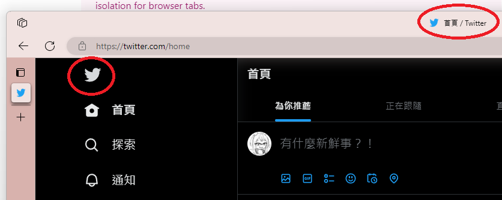
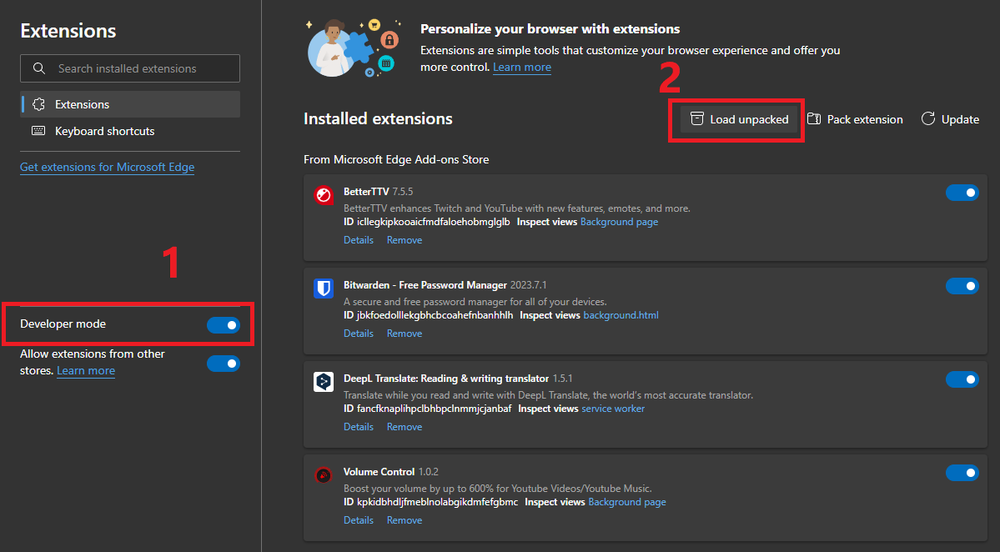
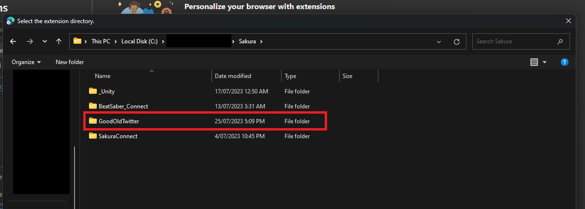

# GoodOldTwitter

這是一個將X圖案換回**推特小鳥**的Chrome擴充功能

## 如何使用

### 商店

> 上傳申請中

### 開發者模式

1. 下載最新的版本這裡 [這裡](https://github.com/FuyukiSakura/GoodOldTwitter/releases/latest/download/GoodOldTwitter.zip)
2. 解壓縮文件
3. 打開擴充功能設定 
4. 啟用開發者模式 -> 加載未打包 
5. 選擇您剛剛解壓縮的文件 
6. 藍鳥回來了～
