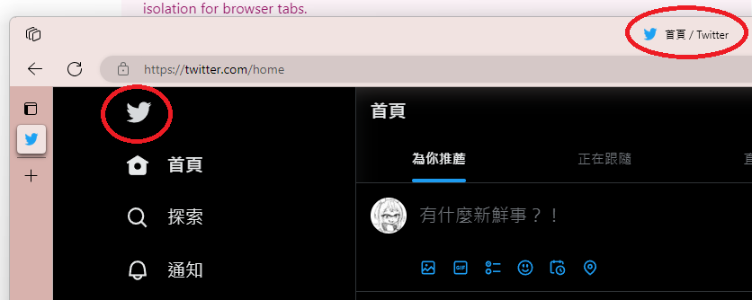
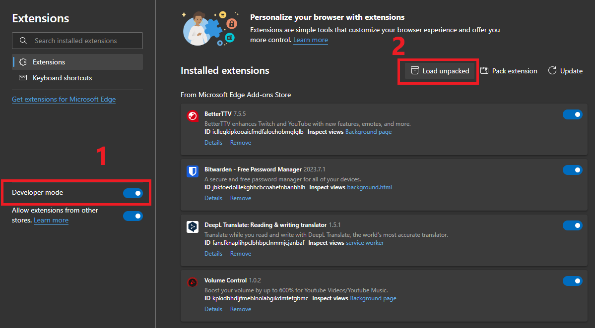

# GoodOldTwitter

A chrome extension that replaces the X icon with the good old twitter bird

## How to use

### Store

> Coming soon. But I am not sure if this can pass certification

### Developer mode

1. Download the latest release [here](https://github.com/FuyukiSakura/GoodOldTwitter/releases/latest/download/GoodOldTwitter.zip)
2. Unzip the files
3. Open the extension settings 
4. Enable developer mode -> Load unpacked 
5. Select the files you just unzipped 
6. Enjoy!
